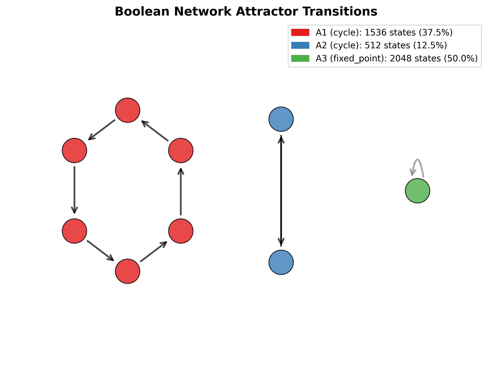
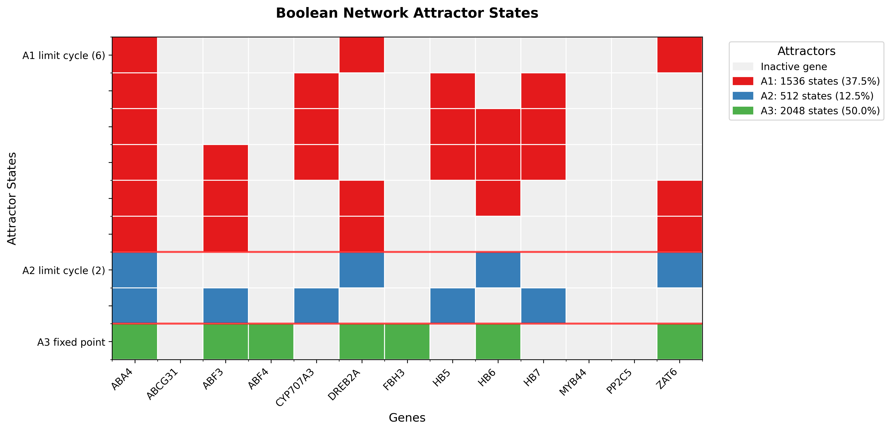

# BNI3: Boolean Network Inference and Analysis

Welcome to the **BNI3** project! BNI3 is a comprehensive pipeline designed for the binarization of gene expression data, inference of Boolean network rules, and the analysis of their dynamic attractors. This toolkit is well-suited for systems biology research, gene regulatory network (GRN) modeling, and dynamic state analysis.

## Overview

The BNI3 pipeline is structured into three main stages, each corresponding to a specific module in the project:

### 1. Binarization (`1.Binarization/`)
Continuous gene expression data (e.g., RNA-Seq counts) must be discretized into binary states (0 for inactive, 1 for active) to model them as Boolean networks. 
* **Algorithms**: **SSD** (Short Series Discretization) and **WCSS** (Within Cluster Sum of Squares).

### 2. Boolean Rules Inference (`2.Rules_Inference/`)
Infers the logical relationships (Boolean rules) between different genes/nodes over time using Gene Expression Programming (GEP).
* Evaluates inferred rules based on cycle lengths, fixed point ratios, and biological concordance.

### 3. Attractors Analysis (`3.Attractors/`)
Maps the steady states or cycles known as *attractors* (biological phenotypes). Simulates sequence transitions and visualizes topological basins.

---

## Interactive Usage Vignette

BNI3 is designed to abstract away the complexity of mathematical modeling. We provide an interactive bash launcher designed to simplify the execution of the entire pipeline using robust default settings.

### Getting Started

To ensure reproducibility across different operating systems, we highly recommend using `conda` to resolve all the Python dependencies required for BNI3.

```bash
# 1. Clone the repository
git clone https://github.com/lucianofrancoo/BNI3.git
cd BNI3

# 2. Create and activate the Conda environment
conda env create -f environment.yml
conda activate bni3_env

# 3. Launch the Interactive Pipeline
./bni3_launcher.sh
```

---

## 1. Binarization Example
Your initial continuous matrix should have **Genes as rows** and **Timepoints/Samples as columns**. Example (`Counts_lite.tsv`):

| ID | 0d | 5d | 11d | 14d |
|---|---|---|---|---|
| **HB7** | 310.66 | 197.00 | 186.66 | 47.33 |
| **ZAT6** | 157.00 | 92.00 | 414.00 | 3217.33 |
| **CYP707A3** | 472.66 | 165.33 | 717.66 | 154.66 |

Select `1` in the Main Menu. BNI3 automatically calculates transition thresholds and generates a **transposed** Binarized Matrix:

| HB7 | ZAT6 | CYP707A3 | ABCG31 | PP2C5 | DREB2A | HB6 | MYB44 |
|---|---|---|---|---|---|---|---|
| 1 | 0 | 1 | 1 | 1 | 0 | 0 | 0 |
| 1 | 0 | 0 | 0 | 0 | 0 | 1 | 0 |
| 1 | 0 | 1 | 0 | 0 | 0 | 1 | 1 |
| 0 | 1 | 0 | 0 | 0 | 1 | 1 | 1 |

---

## 2. Rules Inference & Evaluation Example

Select `2` in the Main Menu. The system will dedicate 100% of your CPU cores `$(nproc)` to evolve logical rules independently for each gene.

Example of rules inferred just for the gene **HB7**:

| Gene | Position | Rule Inferred | Correct Transitions | N_Regulators | Score |
|---|---|---|---|---|---|
| HB7 | 1 | `~ABF3 & ~MYB44` | 3 | 2 | 1.9375 |
| HB7 | 2 | `~ABF3 \| ~CYP707A3` | 3 | 2 | 1.9375 |
| HB7 | 3 | `~MYB44 \| (ABF4 & ~ZAT6)` | 3 | 3 | 1.9375 |

Because BNI3 infers *multiple* valid rules per gene, the Evaluator tests thousands of network combinations to find the ultimate topology (`rules_by_gene_evaluated.tsv`).


---

## 3. Attractors & Biological Perturbations

Select `3` in the Main Menu to calculate steady states. The module outputs `attractors.tsv`:

| attractor_id | type | cycle_length | basin_size | basin_percentage | binary_state |
|---|---|---|---|---|---|
| 1 | fixed_point | 1 | 8192 | 100.0% | 0011011010101 |

Below is the steady state map for our network:

<div style="display: flex; justify-content: space-around; align-items: center;">
  
  
</div>

*(Left: The topological basin network. Right: The steady-state expression heatmap).*

### In-Silico Mutations (e.g. Knockout)
BNI3 allows you to simulate Overexpression (Gene:1) or Knockouts (Gene:0). If we simulate a Knockout of **MYB44:0**, the entire network structure changes:

<div style="display: flex; justify-content: space-around; align-items: center;">
  
  
</div>

*(Notice how shutting down the MYB44 node restructures the hierarchy of the remaining active attractors).*
