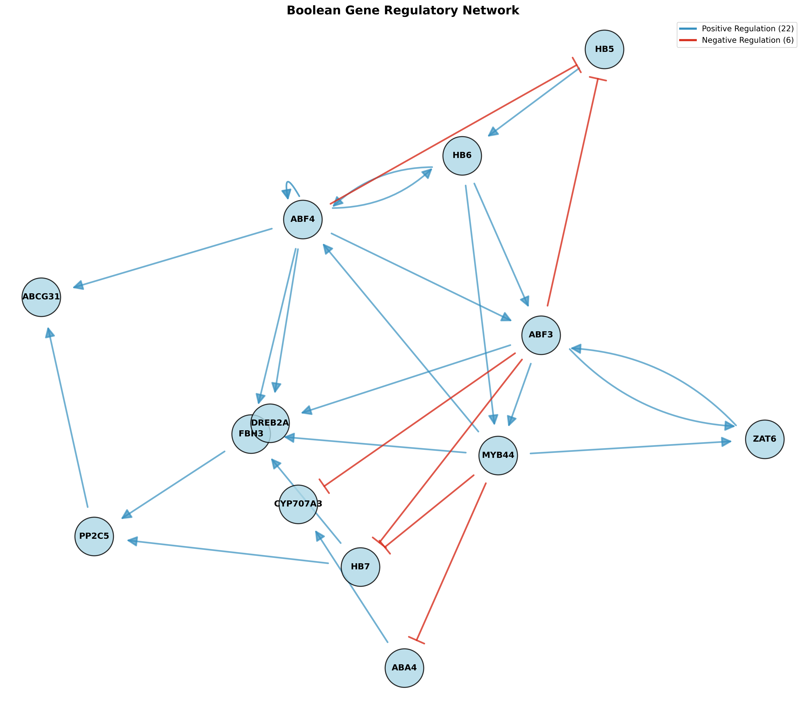
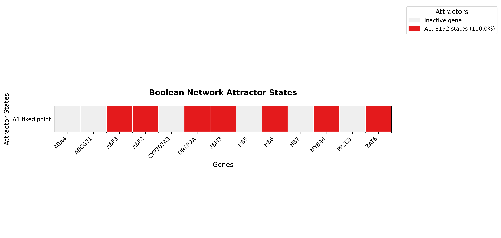
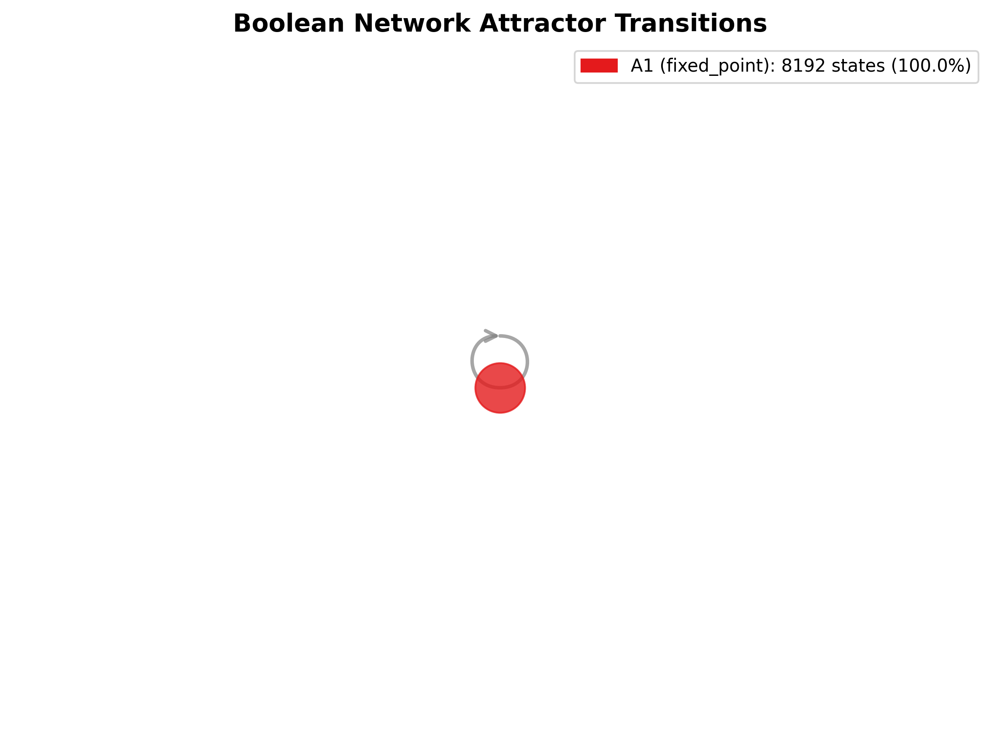

# BNI3: Interactive Usage Vignette

Welcome to the **Boolean Network Inference 3 (BNI3)** official vignette. This guide will walk you through a complete, end-to-end analysis of gene expression data using our interactive bash launcher.

BNI3 is designed to abstract away the complexity of mathematical modeling, providing you with an automated pipeline that takes raw continuous data, binarizes it, infers logical rules using Gene Expression Programming (GEP), and plots the topological attractors representing the stable states of your biological system.

---

## 1. Getting Started

To ensure reproducibility across different operating systems, we highly recommend using `conda` to resolve all the Python dependencies required for BNI3.

```bash
# 1. Clone the repository
git clone https://github.com/lucianofrancoo/BNI3.git
cd BNI3

# 2. Create and activate the Conda environment
conda env create -f environment.yml
conda activate bni3_env

# 3. Launch the Interactive Pipeline
./bni3_launcher.sh
```

---

## 2. Module 1: Binarization

Continuous gene expression data (e.g., RNA-Seq) needs to be discretized. BNI3 natively supports **SSD** (StepMiner) and **WCSS** (K-Means).

### Input Formatting
Your initial continuous matrix should have **Genes as rows** and **Timepoints/Samples as columns**. Let's look at a snippet from our `Counts_lite.tsv` example:

| ID | 0d | 5d | 11d | 14d |
|---|---|---|---|---|
| **HB7** | 310.66 | 197.00 | 186.66 | 47.33 |
| **ZAT6** | 157.00 | 92.00 | 414.00 | 3217.33 |
| **CYP707A3** | 472.66 | 165.33 | 717.66 | 154.66 |

### Output: Binarized Matrix
Select `1` in the Main Menu and provide your `Counts_lite.tsv`. The pipeline will calculate the optimal transition thresholds and generate a Binarized Matrix (`Counts_lite_binarized_SSD.tsv`). 

**Crucially, BNI3 transposes this matrix** automatically (Genes as Columns, Timepoints as Rows) to prepare it for evolutionary inference:

| HB7 | ZAT6 | CYP707A3 | ABCG31 | PP2C5 | DREB2A | HB6 | MYB44 |
|---|---|---|---|---|---|---|---|
| 1 | 0 | 1 | 1 | 1 | 0 | 0 | 0 |
| 1 | 0 | 0 | 0 | 0 | 0 | 1 | 0 |
| 1 | 0 | 1 | 0 | 0 | 0 | 1 | 1 |
| 0 | 1 | 0 | 0 | 0 | 1 | 1 | 1 |

---

## 3. Module 2: Rules Inference & Evaluation

This is the core of BNI3. Using Gene Expression Programming, the module searches millions of possible Boolean logic combinations (`AND`, `OR`, `NOT`) to find the mathematical equations that best describe how your genes transition from one timepoint to the next.

### 3.1 Inference (`rules_by_gene.tsv`)
Select `2` in the Main Menu. Provide the path to **BOTH** your Continuous Matrix and Binarized Matrix. The system will dedicate 100% of your CPU cores `$(nproc)` to evolve logical rules independently for each gene.

Here is an example of the rules inferred just for the gene **HB7**:

| Gene | Position | Rule Inferred | Correct Transitions | N_Regulators | Score |
|---|---|---|---|---|---|
| HB7 | 1 | `~ABF3 & ~MYB44` | 3 | 2 | 1.9375 |
| HB7 | 2 | `~ABF3 \| ~CYP707A3` | 3 | 2 | 1.9375 |
| HB7 | 3 | `~MYB44 \| (ABF4 & ~ZAT6)` | 3 | 3 | 1.9375 |
| HB7 | 4 | `~ABF3 \| ~HB6 \| ~HB7` | 3 | 3 | 1.9375 |

### 3.2 Evaluation & Scoring (`evaluation_results.tsv`)
Because BNI3 infers *multiple* valid rules per gene, the Evaluator tests thousands of network combinations to find the ultimate topology. It calculates a `composite_score` based on:
- `avg_cycle_length` (penalty for long unstable cycles)
- `fixed_point_ratio` (reward for biological stability)
- `final_state_concordance`

The winning topology is then saved as `rules_by_gene_evaluated.tsv` and automatically plotted as a high-resolution topological network!



---

## 4. Module 3: Attractors & Visualization

Once the rules are established, we can calculate the **Attractors**. Attractors are the steady states (fixed points or cycles) where the network eventually settles, often representing biological phenotypes like cell proliferation, differentiation, or homeostasis.

Select `3` in the Main Menu and choose `Find Attractors` and then `Visualize Attractors Landscape`.

The module will scan the state-space and output `attractors.tsv`:

| attractor_id | type | cycle_length | basin_size | basin_percentage | binary_state |
|---|---|---|---|---|---|
| 1 | fixed_point | 1 | 8192 | 100.0% | 0011011010101 |

### Biological Perturbations (In-Silico Mutations)
BNI3 allows you to simulate Overexpression (Gene:1) or Knockouts (Gene:0). By doing this, you can observe how the topological landscape shifts, potentially discovering new attractors or destroying existing ones.

The pipeline automatically renders two vital visualizations for your publications:

#### 1. Attractors Heatmap
Shows the active (red) and inactive (blue) genes across different steady states.


#### 2. Attractors Basin Network
Visualizes the proportional size of the basins of attraction (how many initial states converge into a specific phenotype).

